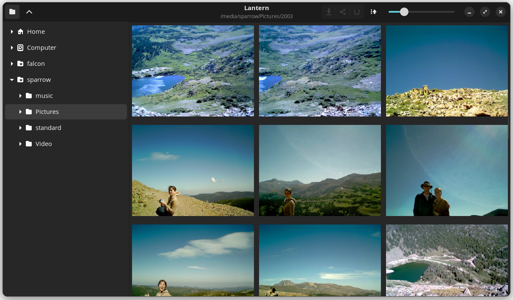

# Lantern

**Find the photo you're looking for.** A fast Linux photo browser with big,
adjustable thumbnails, no library, no database, and nothing cached to disk.

<!-- Screenshot: a folder of real photos at a large thumbnail size, folder
     tree open on the left. Replace this comment with:
      -->

You have thousands of photos in folders, and someone just asked for "that
picture from the beach." File names are useless. Every photo manager wants
to import your library first and then shows you postage stamps. Lantern just
opens the folder and shows you the photos, large, in the order they were
taken, fast enough to scroll through a year in a minute. When you find the
one, send it to Downloads, move it, rename it, rotate it, or trash it.

## Why it's fast

- **No indexing, ever.** There is no import step, no database, and no
  thumbnail cache on disk. Open a folder of 10,000 photos and it works.
- **Decodes only what you can see**, at the size you can see it. A
  12-megapixel JPEG becomes a thumbnail in about 15 ms.
- **Previews first.** Every JPEG carries a tiny preview in its first 64 KB;
  Lantern shows those instantly and sharpens each tile as the full decode
  lands. Over Wi-Fi to a NAS, a screenful is recognizable in under a second.
- **iPhone HEIC works**, using the thumbnail Apple embeds in the file.

## What it does, and all it does

- Grid of subfolders and photos with a size slider from small to huge
- Sort by date taken (from EXIF) or by name
- Full-size viewer with previous/next arrows and a filmstrip
- Folder tree in a sliding sidebar, including mounted drives and network shares
- Move to trash, copy to Downloads, move or rename, rotate (lossless)
- Remembers the last folder and whether the sidebar was open

No tagging, no albums, no face detection, no editing, no cloud. It is a file
manager that is very good at photos.

## Install

Ubuntu 24.04 / Pop!_OS 24.04: download the `.deb` from the
[latest release](https://github.com/loganbecket/lantern/releases/latest),
then:

```
sudo apt install ./lantern_*.deb
```

Lantern shows up in your application menu. Run `lantern ~/Pictures` to open
a folder directly.

## Keys

| Keys | What |
| --- | --- |
| F9 | Show or hide the folder tree |
| Alt+Up | Parent folder |
| Ctrl+scroll, Ctrl+plus / Ctrl+minus, Ctrl+0 | Thumbnail size |
| Enter / double-click | Open a photo or folder |
| Left / Right | Previous / next photo in the viewer |
| Escape | Back to the grid |
| Delete | Move selected photos to the trash |
| Ctrl+D | Copy selected photos to Downloads |
| F2 | Move or rename selected photos |

Right-click a tile for the same actions.

## Rotation without loss

Rotating a JPEG rewrites only its EXIF orientation tag (two bytes; the
pixels are untouched and every viewer honors it), or applies a lossless
libjpeg-turbo transform if the file has no tag. PNG is re-encoded, which is
lossless for PNG. Other formats are left alone. Modified times are
preserved so your sort order doesn't change.

## Build from source

Rust 1.85 or newer, GTK 4.14 and libadwaita 1.5 (Ubuntu 24.04 and later).

```
sudo apt install libgtk-4-dev libadwaita-1-dev libheif-dev cmake nasm
make install
```

`make install` builds a release binary and installs it for the current user
only (no root), with the desktop entry and icon; `make uninstall` removes it.
`make deb` builds the package (needs `cargo install cargo-deb`).

Set `LANTERN_DEBUG=1` to log every decode with its time.

## License

MIT
